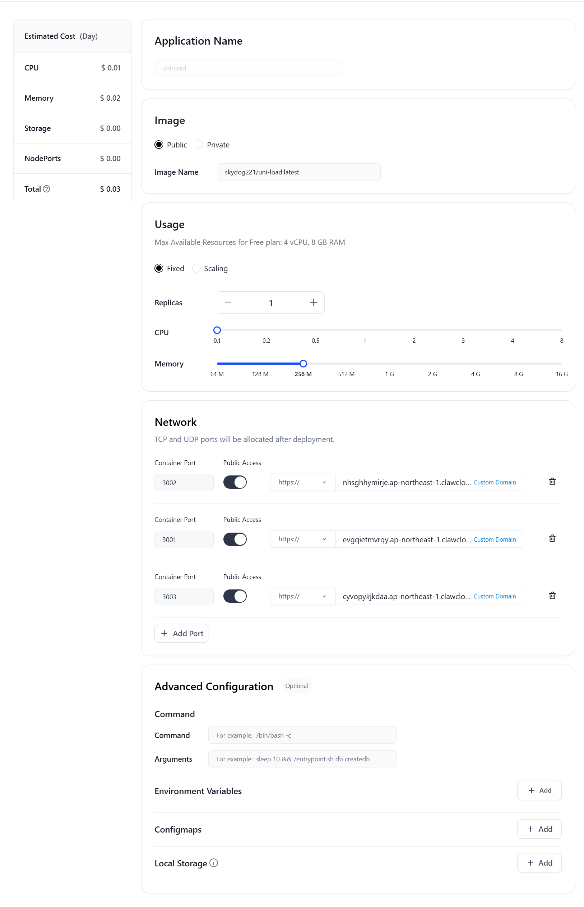

# uni-load

🚀 **AI 站点自动配置工具** - 连接 uni-api 与 gpt-load 的中间桥梁

## 📋 项目简介

uni-load 是一个自动化配置工具，帮助用户快速将第三方 AI 站点集成到 uni-api 和 gpt-load 系统中。通过简单的 Web 界面，用户只需输入 AI 站点的 `baseurl` 和 `apikey`，系统就会自动完成以下工作：

1. 🔍 **获取模型列表** - 调用 AI 站点的 `/v1/models` 接口
2. 🏗️ **创建两层分组** - 在 gpt-load 中创建站点分组和模型分组
3. ⚖️ **配置负载均衡** - 模型分组指向多个站点分组，实现自动负载均衡
4. 📝 **更新配置文件** - 自动修改 uni-api 的 `api.yaml` 配置
5. 🎯 **统一入口访问** - 用户通过 uni-api 统一入口访问所有 AI 模型

## 🌐 gpt-load 多实例支持

支持连接多个 gpt-load 实例，自动为不同站点选择最佳实例：

### 必需配置

> **重要**：启动服务前必须配置 gpt-load 实例，否则服务无法启动！

1. **复制配置文件**

   ```bash
   cp gptload-instances.json.example gptload-instances.json
   ```

2. **编辑配置文件**
   ```json
   [
     {
       "id": "local",
       "name": "本地 gpt-load",
       "url": "http://localhost:3001",
       "priority": 1,
       "description": "本地服务，优先使用",
       "upstream_addresses": [
         "https://us.gpt-load.example.com",
         "https://eu.gpt-load.example.com"
       ]
     },
     {
       "id": "us-proxy", 
       "name": "美国代理 gpt-load",
       "url": "https://us.gpt-load.example.com",
       "token": "your-token-here",
       "priority": 2,
       "description": "用于本地不易访问的站点",
       "upstream_addresses": [
         "https://eu.gpt-load.example.com"
       ]
     },
     {
       "id": "eu-proxy",
       "name": "欧洲代理 gpt-load", 
       "url": "https://eu.gpt-load.example.com",
       "token": "your-token-here",
       "priority": 3,
       "description": "欧洲服务器，最后备选",
       "upstream_addresses": []
     }
   ]
   ```

### 智能路由

- **优先级排序**: 数字越小优先级越高
- **健康检查**: 自动检测实例状态
- **连通性测试**: 测试实例是否能访问目标站点
- **故障转移**: 自动切换到可用实例

## 🏗️ 系统架构

uni-load 采用三层分组架构实现 AI 模型的统一管理。在多实例环境下，第一层（站点分组）会被智能地分配到网络连接最佳的 gpt-load 实例上，而第二、三层（模型分组）则统一创建在首选实例上，以确保内部路由的稳定。

```
用户请求 → uni-api → 模型聚合分组 → 模型-渠道分组 → 站点分组 → AI服务商
```

详细架构设计请参考 [系统架构文档](docs/system-architecture-v2.md)

## 🐋 Docker 部署
国内镜像（本项目镜像和依赖镜像均使用中国镜像）：受开发环境影响，请根据`Dockerfile_China`自行build（`docker build -t yourname/uni-load:china -f Dockerfile_China .`）

全球镜像（不含考虑中国境内网络因素，全部使用官方源）：`skydog221/uni-load:latest`
最低 CPU 要求：`0.1 Core`
最低内存要求：`256 MB` 
需放开公网的端口：`3001`,`3002`,`3003`

## 🎪 PaaS 部署
### claw cloud
在`App Launchpad`中，创建一个APP，并进行如下配置：


## 🚀 自行部署

### 前置条件

确保以下服务正在运行：

- 🔧 **gpt-load** 服务 (默认端口 3001)
- 🌐 **uni-api** 项目位于 `../uni-api` 目录
- 🚀 **bun** 运行时环境 (推荐版本 >= 1.0.0)

### 安装步骤

0. **安装 bun**（如果还没有安装）

```bash
# macOS/Linux
curl -fsSL https://bun.sh/install | bash

# Windows (使用 PowerShell)
powershell -c "irm bun.sh/install.ps1 | iex"

# 或使用 npm
npm install -g bun
```

1. **克隆项目**

```bash
git clone <项目地址>
cd uni-load
```

2. **安装依赖**

```bash
bun install
```

3. **配置 gpt-load 实例**（必需步骤）

```bash
# 复制配置模板
cp gptload-instances.json.example gptload-instances.json

# 编辑配置文件，至少配置本地实例
# 示例：修改 url、token 等参数
```

4. **配置环境变量**

```bash
# 推荐：直接创建本地配置文件
cp .env.example .env.local

# 编辑本地配置文件，根据你的环境调整参数
# .env.local 优先级更高且不会被提交到版本控制
```

5. **启动服务**

```bash
bun start
# 或开发模式（自动重载）
bun dev
```

6. **访问页面**

```
http://localhost:3002
```

## 🛠️ 基本使用

### Web 界面操作

1. 打开 `http://localhost:3002`
2. 填写 AI 站点信息（API地址、密钥、格式类型）
3. 点击"🔧 开始配置"
4. 等待自动配置完成

### API 接口调用

```bash
# 配置 AI 站点
curl -X POST http://localhost:3002/api/process-ai-site \
  -H "Content-Type: application/json" \
  -d '{
    "baseUrl": "https://api.deepseek.com/v1",
    "apiKeys": ["sk-xxx"],
    "channelTypes": ["openai"]
  }'
```

详细 API 说明请参考 [API 接口文档](docs/api.md)

## 📁 项目结构

```
uni-load/
├── src/                          # 源代码目录
│   ├── services/                 # 业务逻辑与基础服务
│   │   ├── dependency-container.ts  # 依赖注入容器
│   │   ├── service-factory.ts       # 服务工厂
│   │   ├── site-configuration.ts    # 站点配置核心服务
│   │   ├── instance-config-manager.ts # 实例配置管理服务
│   │   └── instance-health-manager.ts # 实例健康管理服务
│   ├── gptload.ts               # gpt-load 服务接口层
│   ├── multi-gptload.ts         # 多实例协调器
│   ├── models.ts                # 模型获取服务
│   ├── yaml-manager.ts          # uni-api 配置管理
│   ├── model-sync.ts            # 模型同步服务
│   ├── channel-health.ts        # 渠道健康监控
│   └── ...                     # 其他核心模块
├── public/                      # 静态资源 (Web UI)
├── docs/                       # 项目文档
├── logs/                       # 日志目录
├── dist/                       # 编译输出目录
├── server.ts                   # Express 服务器主文件
├── package.json               # 项目配置
├── Dockerfile                 # Docker 配置文件
└── gptload-instances.json     # gpt-load 实例配置
```

## ⚙️ 环境配置

系统支持多种配置方式，详细配置说明请参考 [部署指南](docs/deployment.md)

### 基本配置

```bash
# 复制配置文件
cp .env.example .env.local
cp gptload-instances.json.example gptload-instances.json

# 编辑配置
vim .env.local              # 环境变量配置  
vim gptload-instances.json  # gpt-load 实例配置
```

## 📚 文档目录

### 基础文档
- 📖 [系统架构设计](docs/architecture.md) - 详细的架构设计和组件说明
- 🔌 [API 接口文档](docs/api.md) - 完整的 API 接口规范和示例
- 🚀 [部署指南](docs/deployment.md) - 多种环境的部署方案和配置
- 🛠️ [开发指南](docs/development.md) - 开发环境设置和编码规范
- ⚙️ [多实例配置说明](docs/multi-gptload-config.md) - gpt-load 多实例配置详解

### 进阶文档
- 👤 [用户操作手册](docs/user-guide.md) - Web 界面和 API 使用的详细指南
- 🏗️ [模块设计文档](docs/module-design.md) - 详细的模块架构和设计模式
- 🏛️ [系统架构设计 v2.0](docs/system-architecture-v2.md) - 三层架构的深度解析

## 🔄 工作流程

1. **模型发现** - 调用 AI 站点的 `/v1/models` 接口获取模型列表
2. **分组创建** - 在 gpt-load 中创建三层分组架构
3. **配置更新** - 自动更新 uni-api 的 `api.yaml` 配置
4. **负载均衡** - 实现多站点、多密钥的智能负载均衡

## 🔍 核心特性

### ✅ 主要功能
- 🌐 **Web 界面管理** - 直观的配置界面
- 🔍 **自动模型发现** - 支持标准 OpenAI API 格式
- 🏗️ **三层分组架构** - 灵活的负载均衡策略
- 🔄 **多实例支持** - 支持多个 gpt-load 实例协调工作
- 🔄 **模型自动同步** - 定期同步模型列表，保持配置最新
- 🧹 **临时资源清理** - 自动和手动清理测试过程中产生的临时分组
- 🩺 **渠道健康监控** - 监控站点渠道健康，自动处理故障
- 📊 **实时监控** - 健康检查和状态监控
- 🔧 **自动化运维** - 模型同步、故障恢复

### 🎯 技术特点
- **TypeScript** - 类型安全的代码质量保证
- **模块化设计** - 清晰的服务层分离
- **容错机制** - 完善的异常处理和恢复
- **性能优化** - 连接池、缓存和并发控制

## 🛠️ 常用命令

```bash
# 开发模式（热重载）
bun dev

# 生产构建
bun run build

# 启动生产服务
bun start

# 构建 Docker 镜像
docker build -t uni-load .

# 健康检查
curl http://localhost:3002/api/health

# 查看系统状态
curl http://localhost:3002/api/status
```

## 🐛 故障排查

详细的故障排查指南请参考 [用户操作手册](docs/user-guide.md#故障排查)

### 快速检查

1. **服务状态** - 确认 gpt-load 和 uni-api 服务正常运行
2. **配置文件** - 检查 `gptload-instances.json` 和环境变量配置
3. **网络连接** - 测试到 AI 站点和 gpt-load 实例的连通性
4. **日志分析** - 查看 `logs/` 目录下的详细日志

## 🤝 贡献指南

欢迎提交 Issue 和 Pull Request！

## 📄 许可证

MIT License

## 🙋‍♂️ 支持

如有问题或建议，请提交 Issue 或联系开发团队。

---

**⚡ 让 AI 模型管理变得简单高效！**
