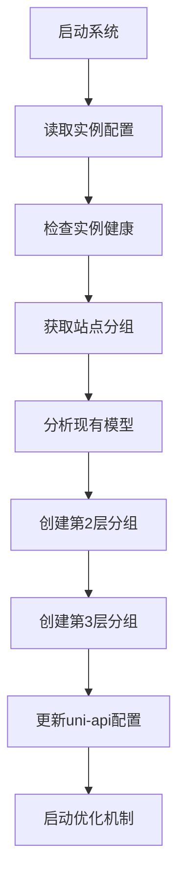
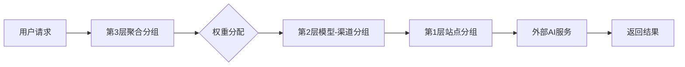

# Uni-Load 系统架构设计文档 v2.0

## 系统概述

Uni-Load 是一个基于 gpt-load 的多实例负载均衡系统，通过三层架构实现AI模型的高效管理和调度。系统采用被动验证策略，避免API消耗，并提供快速的故障隔离和智能恢复机制。

## 核心架构设计

### 三层架构模式

系统采用清晰的三层分组架构，每层都有明确的职责和排序标识：

```
┌─────────────────────────────────────────┐
│  第3层：模型聚合分组 (sort=10)           │
│  - 统一入口，聚合所有渠道的同一模型      │
└─────────────────────────────────────────┘
           │  聚合多个渠道
┌─────────────────────────────────────────┐
│  第2层：模型-渠道分组 (sort=15)          │
│  - 细粒度控制，每个模型在每个渠道的独立  │
│    分组                                 │
└─────────────────────────────────────────┘
           │  代理站点分组
┌─────────────────────────────────────────┐
│  第1层：站点分组 (sort=20)               │
│  - 直接连接外部API，基础数据源          │
└─────────────────────────────────────────┘
```

### 分层职责

#### 第1层：站点分组 (sort=20)
- **职责**：直接连接外部AI服务提供商
- **功能**：
  - 管理API密钥认证
  - 提供基础模型访问
  - 处理渠道特定的API格式
  - 缓存已验证的模型列表
- **命名规范**：`{站点名}-{渠道类型}`
- **验证模型**：使用小模型避免高消耗（如 gpt-4o-mini）

#### 第2层：模型-渠道分组 (sort=15)
- **职责**：实现模型级别的精细控制
- **功能**：
  - 为每个模型在每个渠道创建独立分组
  - 支持模型级别的黑名单管理
  - 提供细粒度的权重控制
  - 实现故障隔离
- **命名规范**：`{模型名}-via-{站点名}`
- **标签**：`["layer-2", "model-channel", {模型名}, {站点名}]`

#### 第3层：模型聚合分组 (sort=10)
- **职责**：提供统一的模型访问入口
- **功能**：
  - 聚合所有渠道的同一模型
  - 智能权重分配和负载均衡
  - 统一的API接口
  - 故障自动切换
- **命名规范**：`{模型名}`
- **标签**：`["layer-3", "model-aggregate", {模型名}]`

## 核心组件

### 1. GptloadService (src/gptload.ts)
**职责**：统一的服务接口层
- **功能**：
  - 封装多实例管理
  - 提供分组创建、更新、删除操作
  - 管理API密钥
  - 健康检查和状态监控
- **关键方法**：
  - `createSiteGroup()`: 创建第1层站点分组
  - `createOrUpdateModelGroups()`: 创建第2层模型-渠道分组
  - `deleteAllModelGroups()`: 清理第3层聚合分组
  - `analyzeChannelHealth()`: 渠道健康分析

### 2. MultiGptloadManager (src/multi-gptload.ts)
**职责**：多实例管理和负载均衡
- **功能**：
  - 管理多个gpt-load实例
  - 实例健康检查
  - 站点到实例的智能分配
  - 故障转移和恢复
- **关键特性**：
  - 优先级排序（priority字段）
  - 健康状态监控
  - 临时分组自动清理
  - 连接测试和验证

### 3. ThreeLayerArchitecture (src/three-layer-architecture.ts)
**职责**：三层架构核心管理
- **功能**：
  - 初始化三层架构
  - 被动恢复机制
  - 权重优化算法
  - 故障分析和处理
- **优化策略**：
  - 缓存机制避免重复API调用
  - 智能权重调整（基于成功率和响应时间）
  - 指数退避的恢复策略

### 4. ModelsService (src/models.ts)
**职责**：模型发现和管理
- **功能**：
  - 从AI提供商获取模型列表
  - 模型验证和过滤
  - 支持多种API格式（OpenAI、Anthropic、Gemini）
  - 重试机制和网络容错

### 5. YamlManager (src/yaml-manager.ts)
**职责**：uni-api配置管理
- **功能**：
  - 更新uni-api的yaml配置
  - 模型重定向和别名管理
  - 配置备份和恢复
  - 提供商配置同步

## 数据流架构

### 初始化流程



### 请求处理流程



## 配置管理

### 实例配置 (gptload-instances.json)
```json
[
  {
    "id": "local",
    "name": "本地实例",
    "url": "http://localhost:3001",
    "token": "your-gptload-token",
    "priority": 1,
    "upstream_addresses": []
  }
]
```

### 层级配置 (layer-configs.ts)
```typescript
export const layerConfigs = {
  siteGroup: {
    sort: 20,
    blacklist_threshold: 5
  },
  modelChannelGroup: {
    sort: 15,
    blacklist_threshold: 3
  },
  aggregateGroup: {
    sort: 10,
    blacklist_threshold: 2
  }
};
```

## 智能优化机制

### 1. 被动恢复策略
- **监控周期**：每5分钟检查一次
- **恢复逻辑**：
  - 检查密钥状态
  - 自动恢复被标记为无效的密钥
  - 指数退避重试机制
  - 最大重试间隔：1小时

### 2. 权重优化算法

系统基于实时性能数据自动优化各层分组的权重分配，实现智能负载均衡。

**优化策略**：
- **优化频率**：每24小时或系统负载低于80%时执行
- **系统负载检查**：优化前检查CPU/内存使用率，高负载时跳过优化
- **缓存机制**：权重未变化时跳过更新，避免不必要的API调用

**权重计算公式**：
```javascript
// 基于成功率和响应时间的权重算法
success_rate = 1 - (failure_rate || 0)
time_factor = Math.max(0.1, 1 - avg_response_time / 10000)
weight = Math.max(1, Math.round(success_rate * time_factor * 100))
```

**算法详解**：
1. **成功率计算**：`成功率 = 1 - 失败率`
2. **时间因子计算**：响应时间越短，因子越高（最小保持0.1）
3. **权重综合**：成功率 × 时间因子 × 100，最小权重为1
4. **权重归一化**：确保权重分布合理

**实际案例**：
```
渠道A: 成功率95%, 响应时间1500ms → weight = 95 * 0.85 * 100 = 81
渠道B: 成功率80%, 响应时间800ms  → weight = 80 * 0.92 * 100 = 74
渠道C: 成功率60%, 响应时间3000ms → weight = 60 * 0.70 * 100 = 42
```

**优化逻辑**：
1. **数据收集**：从gpt-load获取每个分组的统计数据
2. **权重计算**：根据性能数据计算新权重
3. **变化检测**：与缓存权重对比，跳过无变化的分组
4. **批量更新**：更新有变化的分组权重
5. **结果统计**：记录更新成功/跳过/失败的分组数量

### 3. 缓存优化
- **权重缓存**：避免重复计算相同权重
- **分组缓存**：减少API调用
- **模型缓存**：使用已验证模型列表

## 故障处理机制

### 1. 故障检测
- **健康检查**：每30秒检查实例状态
- **日志分析**：每分钟分析请求日志
- **阈值监控**：失败率超过50%触发恢复

### 2. 故障恢复
- **自动重试**：指数退避策略
- **密钥恢复**：自动启用被禁用的密钥
- **权重调整**：降低故障渠道的权重

### 3. 故障隔离
- **分层隔离**：故障只影响特定层级
- **模型隔离**：单个模型故障不影响其他模型
- **渠道隔离**：渠道故障自动切换到健康渠道

## 安全机制

### 1. 密钥管理
- **分组隔离**：密钥按分组管理
- **状态监控**：实时监控密钥有效性
- **自动清理**：定期清理无效密钥

### 2. 访问控制
- **实例认证**：每个实例独立token
- **权限验证**：API密钥权限检查
- **黑名单机制**：自动禁用问题密钥

## 监控和日志

### 1. 健康监控
- **实例监控**：实时检查所有实例状态
- **分组监控**：监控各层分组运行情况
- **性能监控**：响应时间、成功率统计

### 2. 日志分析
- **请求日志**：按分组记录访问日志
- **错误日志**：详细的错误信息和重试记录
- **统计报告**：定期生成运行报告

## 使用示例

### 基本使用
```typescript
// 初始化三层架构
import threeLayerArchitecture from './three-layer-architecture';

await threeLayerArchitecture.initialize();

// 获取架构状态
const status = await threeLayerArchitecture.getArchitectureStatus();
console.log('架构状态:', status);
```

### 模型管理
```typescript
// 创建站点分组
await gptloadService.createSiteGroup(
  'openai-proxy',
  'https://api.openai.com',
  ['sk-xxx'],
  'openai',
  {},
  ['gpt-4o', 'gpt-3.5-turbo']
);

// 初始化三层架构
await threeLayerArchitecture.initialize();
```

## 扩展性设计

### 1. 模型支持
- **白名单机制**：通过model-config.ts管理支持的模型
- **格式适配**：支持OpenAI、Anthropic、Gemini等多种API格式
- **动态扩展**：可随时添加新的模型提供商

### 2. 渠道扩展
- **配置驱动**：通过配置文件添加新的AI服务提供商
- **格式适配**：自动适配不同提供商的API格式
- **权重管理**：支持不同渠道的权重配置

### 3. 实例扩展
- **多实例支持**：支持横向扩展gpt-load实例
- **负载均衡**：智能分配请求到健康实例
- **故障转移**：自动处理实例故障

## 性能优化

### 1. 缓存策略
- **模型缓存**：避免重复获取模型列表
- **权重缓存**：减少不必要的权重更新
- **状态缓存**：缓存实例健康状态

### 2. 批量处理
- **批量创建**：支持批量创建分组
- **批量更新**：统一更新多个分组配置
- **并发控制**：限制并发请求数量

### 3. 资源管理
- **连接池**：复用HTTP连接
- **超时设置**：合理的超时时间配置
- **内存优化**：及时清理临时数据

## 部署建议

### 1. 环境要求
- Node.js 16+
- gpt-load服务运行正常
- 网络访问权限

### 2. 配置文件
- 复制示例配置：
  ```bash
  cp gptload-instances.json.example gptload-instances.json
  ```
- 编辑配置文件，添加你的gpt-load实例信息

### 3. 启动流程
```bash
# 安装依赖
npm install

# 配置环境变量
export GPTLOAD_URL=http://localhost:3001
export GPTLOAD_TOKEN=your-token

# 启动服务
npm start
```

## 故障排查

### 常见问题

1. **实例连接失败**
   - 检查gpt-load服务是否运行
   - 验证token是否正确
   - 确认网络连接

2. **模型获取失败**
   - 检查API密钥权限
   - 验证站点URL是否正确
   - 查看错误日志

3. **分组创建失败**
   - 检查分组名称是否合法
   - 确认实例健康状态
   - 查看配额限制

### 调试工具
```typescript
// 检查实例状态
const status = await gptloadService.getMultiInstanceStatus();
console.log('实例状态:', status);

// 检查分组
const groups = await gptloadService.getAllGroups();
console.log('分组列表:', groups);

// 手动恢复
await threeLayerArchitecture.manualRecovery('gpt-4o', 'openai-proxy');
```

## 总结

Uni-Load通过三层架构实现了AI模型的高效管理和调度，具有以下特点：

1. **分层设计**：清晰的职责分离，便于维护和扩展
2. **智能优化**：基于实际运行数据的权重调整
3. **故障恢复**：自动化的故障检测和恢复机制
4. **性能优化**：多层缓存和批量处理提升效率
5. **安全可靠**：完善的密钥管理和访问控制

这套架构能够有效管理大量AI模型资源，提供稳定可靠的服务，同时具备良好的扩展性和维护性。